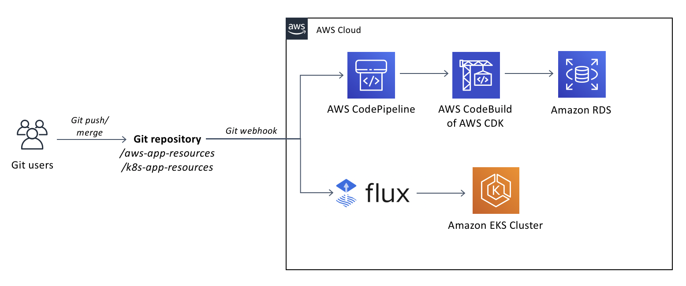
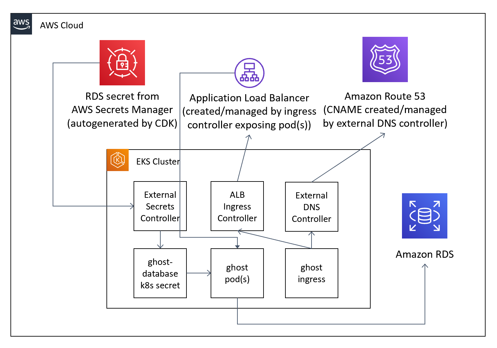

# An example approach for Kubernetes and AWS GitOps

This is a prototype for an approach for GitOps that covers both AWS Managed Services as well as Kubernetes, each with their native tooling, for a more seamless and modern experience.

It represents the AWS-specific resources (such as VPCs, EKS clusters and databases) via CDK/CloudFormation in one set of folders and another set for the Kubernetes equivalents. There are then two separate tools ([CodePipeline](https://aws.amazon.com/codepipeline/) and [Flux](https://github.com/fluxcd/flux)) that reconcile the different types of declarative Infrastructure-as-Code in this project - but all the end-user needs to know is to push/merge their changes to the Git repo.




The folder structure is:

```
k8s-plus-aws-gitops/
  - aws-infrastructure/ for the AWS-specific infrastructure resources (VPC, EKS cluster, etc.)
  - aws-app-resources/ for the AWS and application-specific resources (databases, caches, queues, etc.)
  - k8s-infrastructure/ for the Kubernetes-specific infrastructure resources (Namespaces, RBAC, Operators, etc.)
  - k8s-app-resources: for the Kubernetes and application-specific resources (Deployments, Services, Ingresses, etc.)
  - dockerbuild: for the Dockerfile(s) and associated items required to build the app into a container such as the CodeBuild buildspec.yml(s)
````

To start, the aws-app-resources is GitOps enabled with CodePipeline and the k8s-app-resources is GitOps enabled with Flux.

The aws-infrastructure and k8s-infrastructure are being treated as a bit more imperative as they will not change often and involve CLIs to provision/upgrade. The aws-infrastructure folder in particular has a CodePipeline/CodeBuild cannot be re-run once it has been provisioned (is not idempotent) and so should not re-run on upstream git changes as it is. I will explore how to extend full GitOps to them in the next phase.

